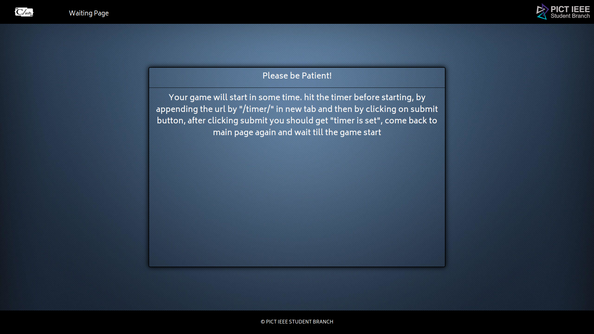
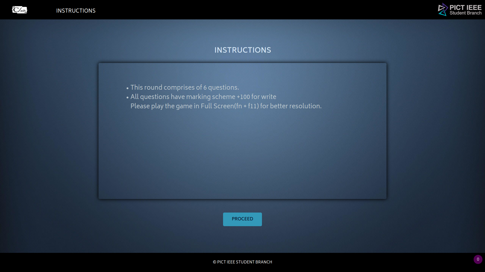
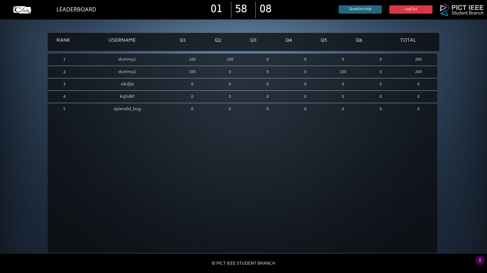
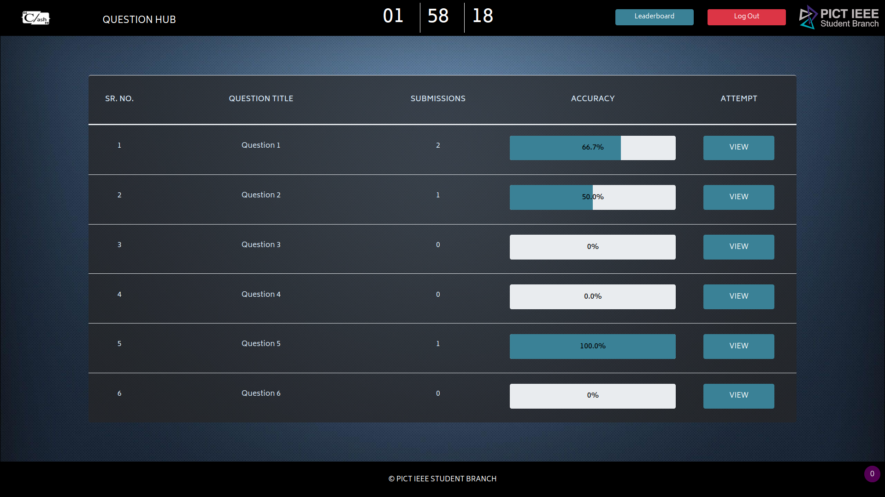
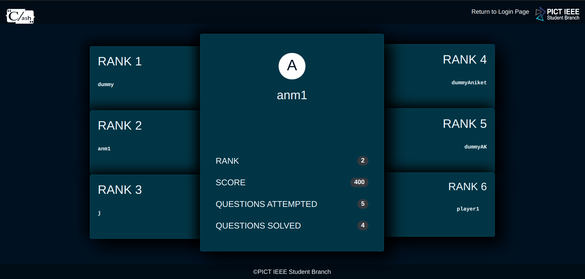
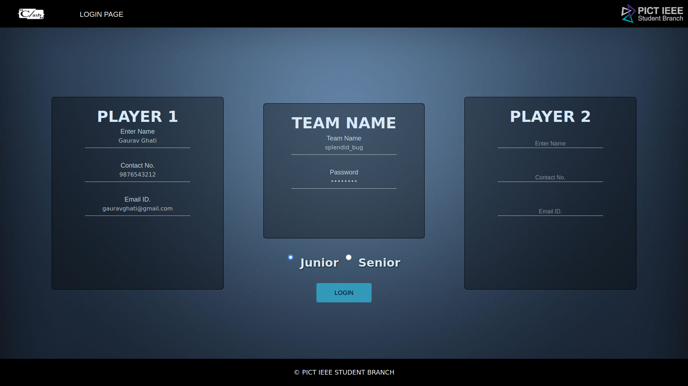
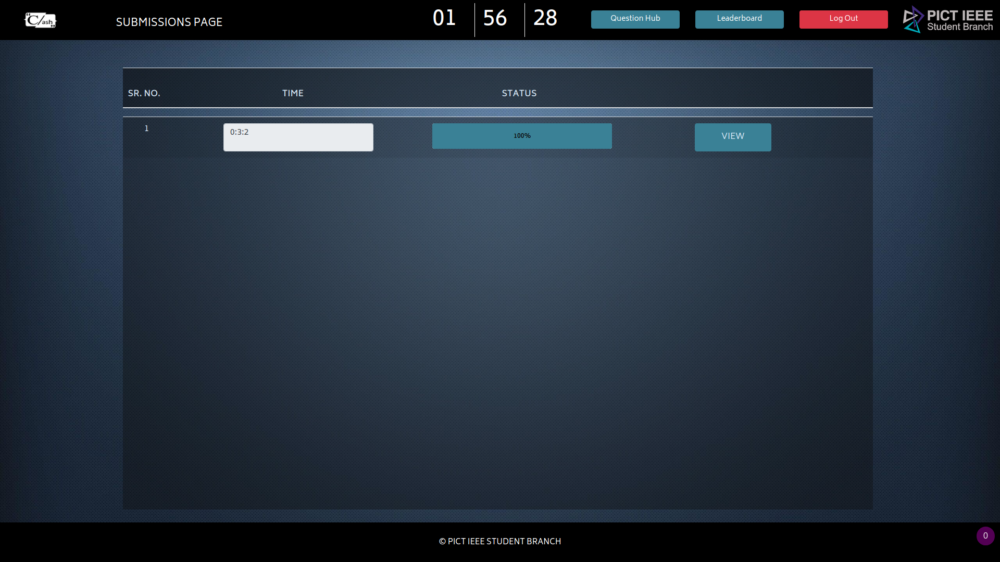
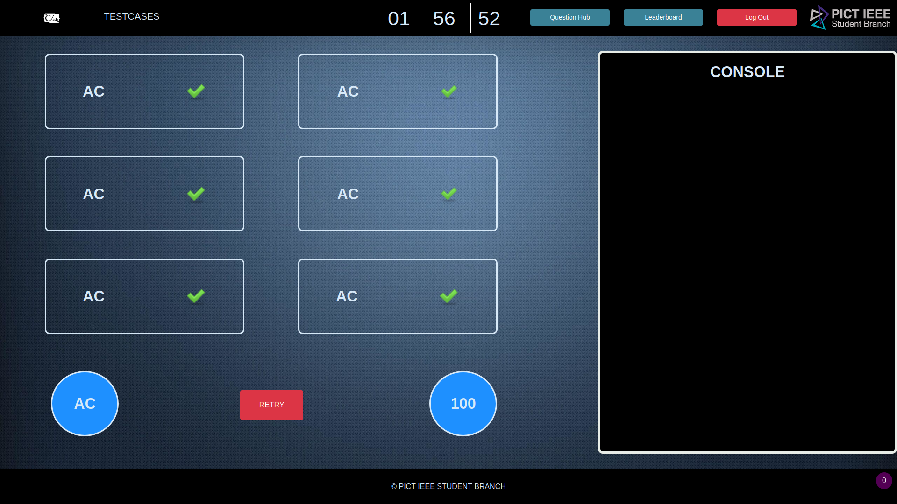

# CLASH RC BACKEND CODE

Click to view Steps to host this Game locally

So, here is a quick guide for installation of this whole game on your PC and host it locally!

### 1) Clone the Project

clone the project by command:
	
	git clone https://github.com/clash-rc-round-2/Clash-Round-2.git

after clone you will find the a directory naming Clash-Round-2 where you cloned this project.

	cd Clash-Round-2/

### 2) creating virtual env and installing required packages

install python3-env and pip for creating a envirnoment.

	sudo apt-get install python3-venv python3-pip

create a virtual envirnoment:

	python3 -m venv env

activate this envirnoment:

	source env/bin/activate

installing all required packages which are present in requirement.txt:

	pip install -r requirements.txt
	
installing all the sandboxing packages, run the script seccomp.sh by command:

	chmod +x seccomp.sh
	./seccomp.sh

You are almost Done! ;)

### 3) Running the code Setting up timer and starting game

Run this game by command:

	python manage.py runserver

hit the timer before starting, by appending the url(i.e. 127.0.0.1:8000) by "/timer/" in new tab and then by clicking on submit button, after clicking submit you should get "timer is set", come back to main page again and wait till the game start

## User Interface
#### 1) Waiting Page (Wait till the Game start)

### 2) Instruction Page

### 3) Coding Page

### 4) LeaderBoard

### 5) Question Page

### 6) Result Page

### 7) SignUp Page

### 8) Submissions Page

### 9) TestCase Page

